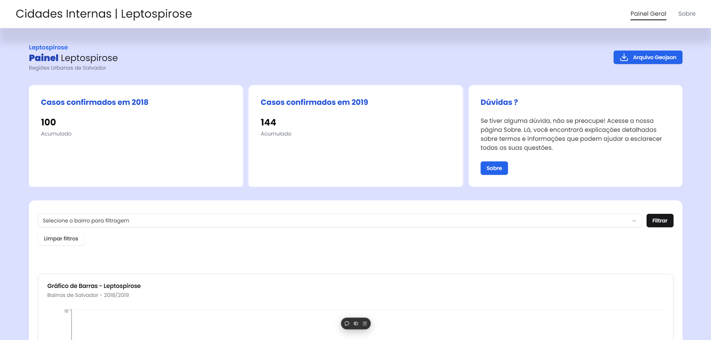

# Leptospirose em Salvador - LUSS

Este projeto foi desenvolvido para o **LUSS (Laboratório UNIFACS de Soluções de Software)** com o objetivo de apresentar, de forma intuitiva, os casos de leptospirose nos bairros de Salvador, Bahia. Por meio de gráficos interativos e mapas, o site oferece uma visualização clara e informativa dos dados.

## Screenshot do Site



## Tecnologias Utilizadas

-   **Next.js** para renderização e estrutura do site.
-   **React** para componentes interativos.
-   **TypeScript** para tipagem estática e maior segurança no código.
-   **Leaflet** para criação de mapas interativos.
-   **Tailwind CSS** para estilização eficiente e responsiva.
-   **ShadcnUi** para a pre-moldagem dos componentes.
-   **Axios** para requisição no lado do client.
-   **recharts** para a criação de gráficos.
-   **Radix-ui** para a ter componentes mais acessíveis.
-   **lucide-react** para ter acesso a ícones.

## Funcionalidades

-   **Gráfico informativo de barra**: Visualize dados de casos de leptospirose por bairro e por ano.
-   **Mapas interativos**: Explore os bairros de Salvador destacados pelos índices de leptospirose.
-   **Interface amigável e responsiva**: Navegue facilmente em qualquer dispositivo.

## Como Rodar o Projeto

Siga as instruções abaixo para executar o projeto localmente:

1. **Clone o repositório ou faça o download dos arquivos:**

    ```bash
    git clone git@github.com:Sinvalluz/Cidades-Internas.git
    cd <NOME_DA_PASTA_DO_PROJETO>
    ```

2. **Instale as dependências necessárias:**

    ```bash
    npm install
    ```

3. **Inicie o servidor de desenvolvimento:**

    ```bash
    npm run dev
    ```

4. **Acesse o site no navegador:**

    Abra o endereço http://localhost:3000/.

    Api: http://localhost:3000/api/getLeptoData.
